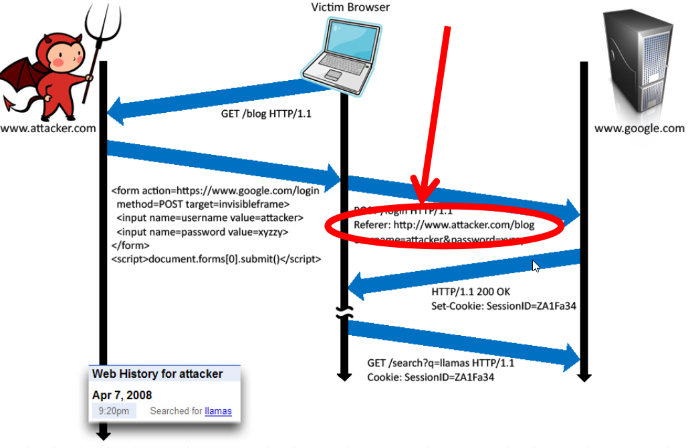

HTTP/TLS
=========

TLS/SSLは、安全でない通信チャネルを暗号化することができるプロトコルです。
TLS/SSLの最も一般的な使用法は、`HTTPS` とも呼ばれる安全な `HTTP` 通信を提供することです。
このプロトコルは、通信チャネルに以下の特性が適用されることを保証します。

* プライバシー
* 認証
* データの完全性

Goでの実装は `crypto/tls` パッケージにあります。
このセクションでは、Goの実装と使い方に焦点を当てます。
プロトコルの設計の理論的な部分と、暗号のプラクティスはこの記事の範囲外ですが、追加情報は[Cryptography Practices][1] を参照してください。

以下は、TLSを使用したHTTPの簡単な例です。

```go
import "log"
import "net/http"

func main() {
  http.HandleFunc("/", func (w http.ResponseWriter, req *http.Request) {
    w.Write([]byte("This is an example server.\n"))
  })

  // yourCert.pem - path to your server certificate in PEM format
  // yourKey.pem -  path to your server private key in PEM format
  log.Fatal(http.ListenAndServeTLS(":443", "yourCert.pem", "yourKey.pem", nil))
}
```

これはGoを使ったウェブサーバーでのSSLのシンプルですぐ動かせる実装です。
この例が SSL Labs で "A" グレードを獲得していることは注目に値します。

通信のセキュリティをさらに向上させるために、以下のフラグをヘッダーに追加して、HSTS (HTTP Strict Transport Security) を強制することができます。

```go
w.Header().Add("Strict-Transport-Security", "max-age=63072000; includeSubDomains")
```

GoのTLSの実装は `crypto/tls` パッケージにあります。TLSを使うときは
標準的なTLSの実装を1つだけ使用し、設定が適切なことを確認してください。

さっきの例を用いて、以下に SNI (Server Name Indication) を実装する例を載せます。

```go
...
type Certificates struct {
    CertFile    string
    KeyFile     string
}

func main() {
    httpsServer := &http.Server{
        Addr: ":8080",
    }

    var certs []Certificates
    certs = append(certs, Certificates{
        CertFile: "../etc/yourSite.pem", //Your site certificate key
        KeyFile:  "../etc/yourSite.key", //Your site private key
    })

    config := &tls.Config{}
    var err error
    config.Certificates = make([]tls.Certificate, len(certs))
    for i, v := range certs {
        config.Certificates[i], err = tls.LoadX509KeyPair(v.CertFile, v.KeyFile)
    }

    conn, err := net.Listen("tcp", ":8080")

    tlsListener := tls.NewListener(conn, config)
    httpsServer.Serve(tlsListener)
    fmt.Println("Listening on port 8080...")
}
```

TLSを使用する場合、証明書は有効であること、正しいドメイン名を持つこと、有効期限が切れていないことに、さらに[OWASP SCP Quick Reference Guide][2]で推奨されているように、必要な場合は中間証明書もインストールする必要があることに留意しましょう。

**重要:** 無効なTLS証明書は常に拒否されるべきです。 `InsecureSkipVerify` を `true` に設定しないように確認してください。 
次のスニペットは、この設定方法の例です。

```go
config := &tls.Config{InsecureSkipVerify: false}
```

Use the correct hostname in order to set the server name:

```go
config := &tls.Config{ServerName: "yourHostname"}
```

TLSに対して注意すべきもう一つの既知の攻撃は、POODLEと呼ばれるものです。これは
これは、クライアントがサーバーの要求する暗号をサポートしていない場合のTLS接続フォールバックに関連するものです。
これにより、接続を脆弱な暗号にダウングレードすることができます。

デフォルトでは、GoはSSLv3を無効にし、暗号の最小バージョンと最大バージョンは以下の設定で設定できます。
バージョンは次の設定で設定できます。


```go
// MinVersion contains the minimum SSL/TLS version that is acceptable.
// If zero, then TLS 1.0 is taken as the minimum.
  MinVersion uint16
```

```go
// MaxVersion contains the maximum SSL/TLS version that is acceptable.
// If zero, then the maximum version supported by this package is used,
// which is currently TLS 1.2.
MaxVersion uint16
```

使用されている暗号の安全性は、[SSL Labs][4]で確認することができます。

ダウングレード攻撃を軽減するためによく使われる追加のフラグは、[RFC7507][3]で定義されている `TLS_FALLBACK_SCSV` です。Goでは、フォールバックはありません。

Googleの開発者Adam Langleyからの引用です。

> Goクライアントはフォールバックを行わないので、TLS_FALLBACK_SCSVを送信する必要はありません。

CRIMEとして知られる別の攻撃は、圧縮を使用するTLSセッションに影響を与えます。
圧縮はプロトコルのコア部分ですが、オプションです。Go で書かれたプログラムは脆弱ではないでしょう。なぜなら現在、`crypto/tls` はいずれの圧縮メカニズムをサポートしていないからです。Go でラッパーされた外部のセキュリティライブラリを利用した場合、アプリケーションは脆弱性を持つ可能性があることは十分に注意してください。

TLS のもう一つの側面んは、接続の再ネゴシエーションです。安全でない接続が確立されないことを保証するために、ハンドシェイクが中断された場合 `GetClientCertificate` とその関連するエラーコードが利用されます。
エラーコードをキャプチャすることで、安全でないチャネルが使用されることを防ぐことができます。

すべてのリクエストは、UTF-8 のようなあらかじめ決められた文字エンコーディングでエンコードされるべきです。
これはヘッダーに設定することができます。

```go
w.Header().Set("Content-Type", "Desired Content Type; charset=utf-8")
```

HTTPコネクションを扱う際のもう一つの重要な点は、外部へのアクセス時に、HTTPヘッダーに機密情報が含まれていないことです。
接続が安全でないため、HTTPヘッダーから情報が漏れる可能性があります。


Image Credits : [John Mitchell][5]

[1]: ../cryptographic-practices/README.md
[2]: https://www.owasp.org/images/0/08/OWASP_SCP_Quick_Reference_Guide_v2.pdf
[3]: https://tools.ietf.org/html/rfc7507
[4]: https://ssllabs.com/
[5]: https://crypto.stanford.edu/cs155old/cs155-spring14/lectures/09-web-site-sec.pdf
