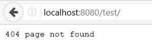

システム構成
====================

セキュリティにおいて、常に最新の状態に保つことは必須です。このことを念頭に置いて、開発者は
開発者は、Go を常に最新版に更新し、Web アプリケーションで使用する外部パッケージや
フレームワークも最新のものに更新しておく必要があります。

Go では、サーバーへのリクエストはすべて HTTP/1.1 か HTTP/1.2 で行われることを知っておく必要があります。

```go
req, _ := http.NewRequest("POST", url, buffer)
req.Proto = "HTTP/1.0"
```

[Proto][3] は無視され、HTTP/1.1によるリクエストとなります。

## ディレクトリの一覧表示

開発者がディレクトリ一覧表示(OWASPでは[Directory Indexing][4]と呼ぶ)を無効にするのを忘れた場合
、攻撃者はディレクトリ内を移動して機密ファイルをチェックすることができます。

Go ウェブサーバアプリケーションを動かしているなら、この点にも注意する必要があります。

```go
http.ListenAndServe(":8080", http.FileServer(http.Dir("/tmp/static")))
```

If you call `localhost:8080`, it will open your index.html. But imagine that you
have a test directory that has a sensitive file inside. What happen next?


なぜこのようなことが起こるのでしょうか？
Go はディレクトリの中にある `index.html` を探そうとします。
が存在しない場合、ディレクトリのリストを表示します。

これを解決するには、3つの解決策があります。

* ウェブアプリケーションでディレクトリのリストを表示しないようにする。
* 不要なディレクトリやファイルへのアクセスを制限する。
* 各ディレクトリにインデックスファイルを作成する

本ガイドでは、ディレクトリの一覧表示を無効にする方法を説明します。
まず、リクエストされたパスをチェックし、表示可能かどうかを確認する関数を作成し
表示させる関数を作成します。

```go
type justFilesFilesystem struct {
    fs http.FileSystem
}

func (fs justFilesFilesystem) Open(name string) (http.File, error) {
    f, err := fs.fs.Open(name)
    if err != nil {
        return nil, err
    }
    return neuteredReaddirFile{f}, nil
}
```

そして、次のように `http.ListenAndServe` に対して使用するだけです。

```go
fs := justFilesFilesystem{http.Dir("tmp/static/")}
http.ListenAndServe(":8080", http.StripPrefix("/tmp/static", http.FileServer(fs)))
```

このアプリケーションでは、`tmp/static/` のパスだけ閲覧を許可していることに注意してください。
保護されたファイルに直接アクセスしようとすると、次のようになります。


また、`test/` フォルダに対してディレクトリリスティングしようしても、同じエラーが表示されます。



## 不要なものの削除/無効化

本番環境では、不要な機能およびファイルをすべて削除してください。
(本番環境へ移行する)最終バージョンで必要とされないテストコードや機能は、開発者レイヤーに留めておくべきです。
誰もが見ることができる場所、つまり公開される場所には置かないようにしましょう。

HTTPレスポンスヘッダもチェックすべきです。以下のような機密情報を開示するヘッダは削除してください。
のような機密情報を開示するヘッダを削除します。

* OSのバージョン
* ウェブサーバーのバージョン
* フレームワークやプログラミング言語のバージョン

HTTP Response Headers should also be checked. Remove the headers which disclose
sensitive information like:


攻撃者がバージョンの脆弱性を確認するために使用される可能性があるため、削除することをお勧めします。

デフォルトでは、Goによって開示されることはありません。しかし、もしあなたが何らかの外部パッケージやフレームワークを使用している場合は、ダブルチェックを忘れないようにしてください。

以下のようなものを探してみてください。

```go
w.Header().Set("X-Request-With", "Go Vulnerable Framework 1.2")
```

公開されているHTTPヘッダーのコードを探して、削除することができます。

また、ウェブアプリケーションがサポートするHTTPメソッドを定義することができます。
POST と GET しか使わない/受け入れない場合は、CORS を実装して次のようにします。

```go
w.Header().Set("Access-Control-Allow-Methods", "POST, GET")
```

WebDAVなどの無効化は気にしないでください。もし
WebDAV サーバを実装したい場合は、[パッケージのインポート][2]が必要です。

## より良いセキュリティを実現する

セキュリティを考慮し、サーバ、プロセス、およびサービスアカウントについて、[最小権限の原則][1]に従いましょう。

Web アプリケーションのエラー処理に気をつけましょう。例外が発生したら、安全に失敗しましょう。このトピックの詳細については、[エラー処理とログ記録][5]のセクションを参照してください。


`robots.txt` ファイルによってディレクトリ構造が漏れないようにしましょう。
`robots.txt` はディレクションファイルであり、セキュリティコントロールではありません。
以下のように、ホワイトリスト方式を採用すしましょう。

```
User-agent: *
Allow: /sitemap.xml
Allow: /index
Allow: /contact
Allow: /aboutus
Disallow: /
```

The example above will allow any user-agent or bot to index those specific
pages, and disallow the rest. This way you don't disclose sensitive folders or
pages - like admin paths or other important data.

Isolate the development environment from the production network. Provide the
right access to developers and test groups, and better yet, create additional
security layers to protect them. In most cases, development environments are
easier targets to attacks.

Finally, but still very important, is to have a software change control system
to manage and record changes in your web application code (development and
production environments). There are numerous Github host-yourself clones that
can be used for this purpose.

## Asset Management System:

Although an `Asset Management System` is not a Go specific issue, a short
overview of the concept and its practices are described in the following
section.

`Asset Management` encompasses the set of activities  that an organization
performs in order to achieve the optimum performance of their assets in line
with its objectives, as well as the evaluation of the required level of security
of each asset.
It should be noted that in this section, when we refer to _Assets_, we are not
only talking about the system's components but also its software.

The steps involved in the implementation of this system are as follows:

1. Establish the importance of information security in business.
2. Define the scope for AMS.
3. Define the security policy.
4. Establish the security organization structure.
5. Identify and classify the assets.
6. Identify and assess the risks
7. Plan for risk management.
8. Implement risk mitigation strategy.
9. Write the statement of applicability.
10. Train the staff and create security awareness.
11. Monitor and review the AMS performance.
12. Maintain the AMS and ensure continual improvement.

A more in-depth analysis of this implementation can be found [here][5].

[1]: https://www.owasp.org/index.php/Least_privilege
[2]: https://godoc.org/golang.org/x/net/webdav
[3]: https://golang.org/pkg/net/http/#Request
[4]: https://www.owasp.org/index.php/OWASP_Periodic_Table_of_Vulnerabilities_-_Directory_Indexing
[5]: https://www.giac.org/paper/gsec/2693/implementation-methodology-information-security-management-system-to-comply-bs-7799-requi/104600
